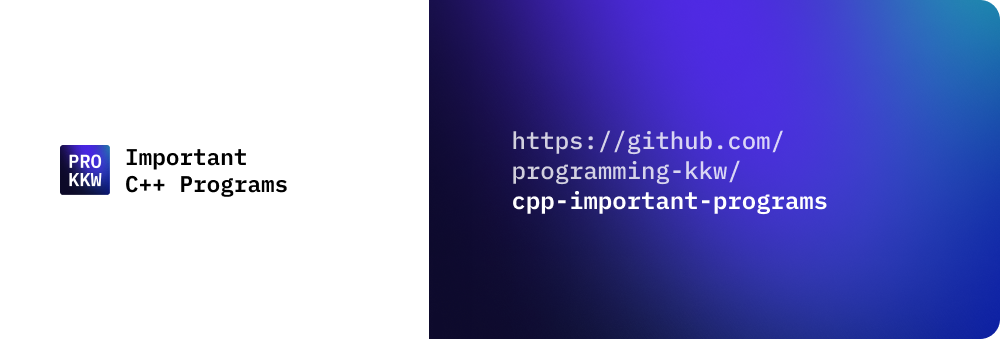

# C++ Important Programs

## Table of Contents

-   [About](#about)

-   [How To Contribute](#how-to-contribute)

-   [Contributors](#contributors)

-   [License](#license)

## About

This repository contains some of the important programs in C++. These programs are very useful for beginners as well as for experienced programmers.

It is made to help beginners to understand the concepts of C++ programming language.

## How To Contribute

There are no specific rules for contributing to this repository. You can contribute any program in C++. However, if you want, you can take code from the [C Important Programs](https://github.com/programming-kkw/c-important-programs) repository and convert it to C++ in this repository.

To get started with contributing, read the [CONTRIBUTING.md](CONTRIBUTING.md) file.

## Contributors

Made with [contrib.rocks](https://contrib.rocks).

## License

This project uses the following license: **MIT License**.

## Thank You.